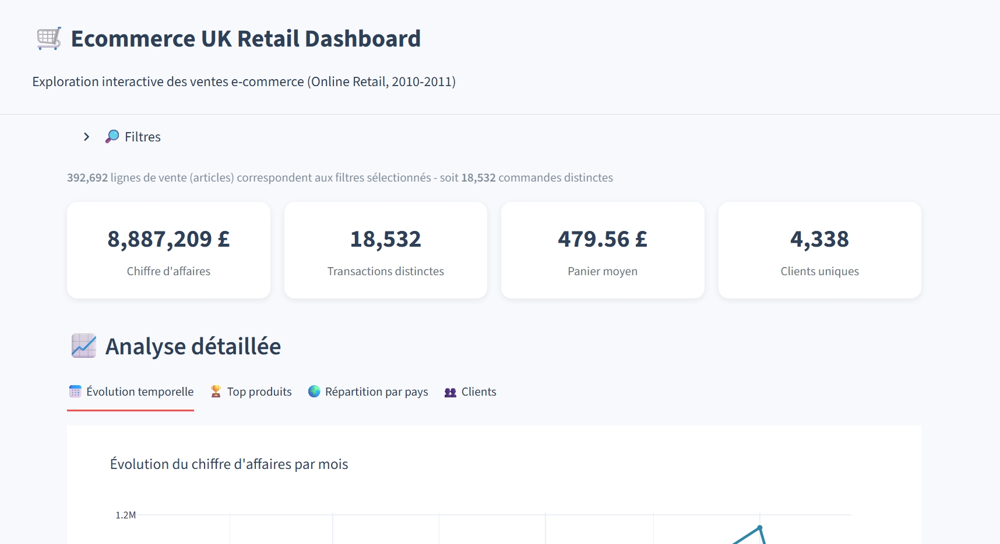

# Ecommerce UK Retail — Analyse & Dashboard

Analyse complète d'un dataset de transactions e-commerce britannique (Online Retail,
2010-2011) : nettoyage, exploration statistique avancée, KPIs, et dashboard interactif.

## Structure du projet

```
Ecommerce_UK_Retail/
├── notebooks/
│   ├── 01_data_import.ipynb          # Import et nettoyage des données brutes
│   ├── 02_exploratory_analysis.ipynb # EDA : distributions, produits, pays, séries temporelles, anomalies
│   └── 03_KPI_analysis.ipynb         # Calcul des KPIs clés (CA, transactions, panier moyen, clients)
├── dashboard/
│   └── 04_streamlit_app.py           # Dashboard interactif (filtres pays/produits/dates)
├── data/
│   ├── raw/                          # Données brutes (non versionnées, voir .gitignore)
│   └── processed/                    # Données nettoyées + résumé KPI
├── outputs/
│   └── figures/                      # Graphiques exportés
└── requirements.txt
```

## Aperçu du dashboard




## Ce que couvre l'analyse

- **Nettoyage** : suppression des commandes annulées, valeurs manquantes, doublons, incohérences de prix/quantité
- **Exploration** : distribution des prix/quantités, top produits et pays, concentration géographique du CA
- **Analyse temporelle** : évolution quotidienne/mensuelle du CA, heatmap jour/heure, décomposition saisonnière (STL)
- **Détection d'anomalies** : trois méthodes comparées (écart-type, IQR, résidus de décomposition STL)
- **KPIs** : chiffre d'affaires total, nombre de transactions, panier moyen, clients uniques
- **Dashboard** : exploration interactive avec filtres dynamiques (Streamlit + Plotly)

## Installation

```bash
pip install -r requirements.txt
```

## Utilisation

1. Placer le fichier de données brut dans `data/raw/`
2. Exécuter `notebooks/01_data_import.ipynb` pour générer les données nettoyées
3. Exécuter `02_exploratory_analysis.ipynb` puis `03_KPI_analysis.ipynb`
4. Lancer le dashboard :
```bash
cd dashboard
streamlit run 04_streamlit_app.py
```

## Dataset

Source : [Online Retail Dataset](https://archive.ics.uci.edu/dataset/352/online+retail) —
transactions d'un e-commerce britannique, décembre 2010 à décembre 2011.

## Auteur

Richard GNALOU — Étudiant L2 Big Data, UCAO-UUT (Lomé, Togo)
GitHub : [Ricardo1826](https://github.com/Ricardo1826)
